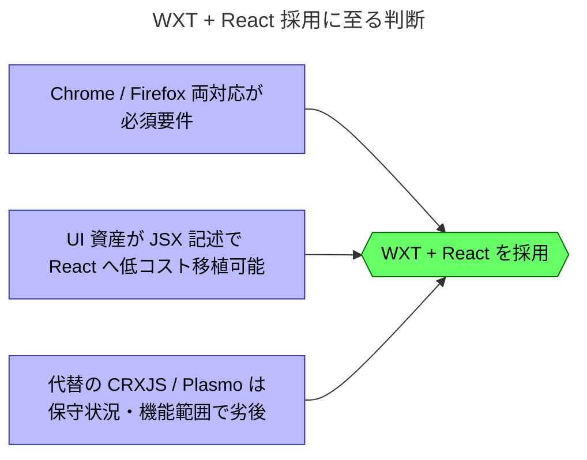

# 拡張のビルド基盤に WXT、UI に React を採用

## 背景

`20260709-rebuild-as-ts-monorepo-for-extension-cli-mcp.md` でブラウザ拡張を主力アプリケーションとすることを決めた。一方でビルド基盤・UI フレームワーク・表出形態は未決のままだった。拡張は Chrome と Firefox の両プラットフォーム対応を必須要件とし、旧実装から移植する UI 資産は Hono JSX で記述されている。この3点は相互に依存するため、単一の判断としてまとめて検討した。

## 判断

`apps/extension` のビルド基盤に WXT を、UI フレームワークに React を採用する。主要 UI は拡張内のフルページ（タブとして開く独立ページ）とし、manifest バージョンは WXT の既定に従って Chrome 向けを MV3、Firefox 向けを MV2 でビルドする。

### 影響

- ビルドは `wxt -b chrome` / `wxt -b firefox` のブラウザ別ターゲットとなり、単一成果物を両ブラウザで共用しない。
- 旧実装の Hono JSX コンポーネントと `client-script` のロジックは、React コンポーネントへの書き換え対象となる。

### 未決事項

- popup・content script 等、フルページを補助する表出形態の要否。
- ストア配布（Chrome Web Store / Firefox AMO）の具体は前 ADR から引き続き未決。

## 根拠

### 理由

- WXT は単一コードベースからブラウザ別ビルドを生成でき、両対応要件を最小コストで満たす。
- 公式 React モジュールと Bun の一次サポートがあり、既存ツールチェーンへ追加の接着なく載る。
- React の JSX は Hono JSX と記法がほぼ同一で、UI 資産の移植コストが最小になる。
- WXT 既定の Firefox=MV2 は、Mozilla の MV2 継続方針（調査結果参照）を踏まえた現実的な差異吸収策である。

### 検証結果

2026-07-09、Windows の Firefox 152 に一時読み込みした MV2 テスト拡張で、セッション相乗りを確認した。Origin が `moz-extension://` のまま、読み取り3件（`GET /auth/user`・friends・userNotes）と書き込み1件（`PUT /users/{id}` の同値書き戻し）がいずれも 200 を返した。Chrome での既存検証（前 ADR に記録）と合わせ、両対象ブラウザで相乗りが成立する。

### 調査結果

2026-07-09 時点の主要な選択肢の状況を比較した。

| 選択肢 | 最新リリース | 保守・機能の状況 |
|---|---|---|
| WXT | `wxt@0.20.27`（2026-06-23） | GitHub ★約10k。`-b` でブラウザ別ビルド、`@wxt-dev/module-react@1.2.2`、Bun 一次サポート |
| CRXJS | `@crxjs/vite-plugin@2.7.1`（2026-07） | 3年超のベータ停滞を経て2025-06に新体制で 2.0。Vite プラグイン単体でブラウザ別ターゲット機構なし |
| Plasmo | `plasmo@0.90.5`（2025-05-17） | ★13.1k だが以後14か月リリースなし。停滞と判断 |
| 素の Vite | — | manifest の MV2/MV3 分岐・HMR・パッケージングを自前で負う |

<Callout type="note">Firefox は MV3 の `background.service_worker` を実装せず event page を用いるため、Chrome と単一の manifest を共有できない。WXT のブラウザ別ビルドと Firefox=MV2 既定はこの差異を吸収する。Mozilla は2024-03に MV2 を当面廃止しない方針を表明しており、MV2 継続のリスクは低い。</Callout>
