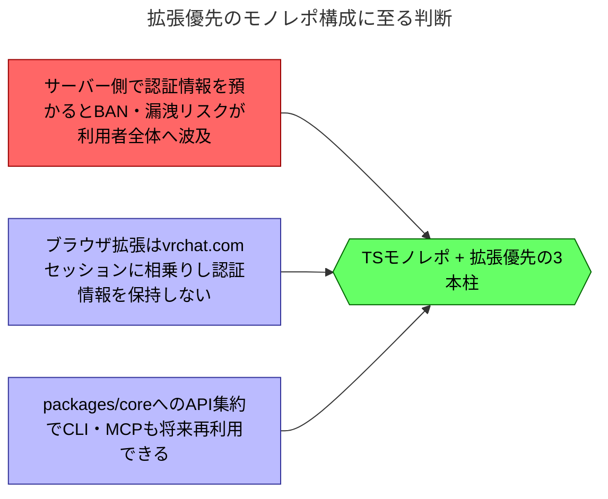

# TypeScript モノレポへの再構築と拡張優先の3本柱化

## 背景

従来の `vrc-toolkit` は Cloudflare Workers 上で動作する Web アプリだった。開発者自身の VRChat アカウント情報をサーバー側で預かり、非公式 API を代理呼び出しする構成を取っていた。この構成を他ユーザーにも公開する前提で見直したところ、認証情報をサーバー側で中央管理すること自体が、漏洩や BAN のリスクを利用者全体に負わせる負債になると判断するに至った。そこで認証情報を一切保持しない構成が技術的に成立するかを検証し、実装方式そのものを再検討した。

## 判断

`vrc-toolkit` を TypeScript のモノレポとして再構築する。ブラウザ拡張（MV3）を主力アプリケーションとし、CLI と MCP サーバーは低優先度の将来アプリケーションとする3本柱構成を採用する。共有ロジックは `packages/core` に集約し、いずれのアプリも認証情報を保持しない。

### 影響

- 旧 Cloudflare Workers 実装（Hono 製 Web アプリ）は本リポジトリの範囲外とし、個人利用の範囲で存続する。UI・ドメインロジックは本リポジトリへの移植資産として扱う。
- リポジトリを `apps/`（エントリポイント）と `packages/`（共有ロジック）のモノレポへ移行する。
- 認証情報を中央で預かる設計を放棄し、サーバー側の秘密情報管理・BAN 対応の運用負荷がなくなる。

### 未決事項

- 拡張の scaffold 方式（Vite ベースの MV3 テンプレート採用可否、`manifest.json` の権限設計）。
- 配布先（Chrome Web Store と Firefox AMO の両対応可否、審査要件の調査）。
- MCP サーバーのレート制御方式（`packages/core` 側でのスロットリング共通化の設計）。

## 根拠

### 理由

- ブラウザ拡張は利用者自身の `vrchat.com` セッションに相乗りでき、認証情報を持たずに読み書き双方の操作を実現できる。
- CLI・MCP は認証情報の扱い（トークン保存か手動ログインか）が未解決で、拡張より設計コストが高いため後回しにする。
- `packages/core` に API クライアントを集約すれば、CLI・MCP 実装時にもロジックを再利用でき、拡張優先の判断と両立する。

### 検証結果

2026-07-08、Chrome 向けの最小テスト拡張で以下を確認した。`host_permissions` に `https://vrchat.com/*` を指定した拡張を用意した。そこから `credentials: 'include'` 付きで `https://vrchat.com/api/1/...` を呼び出す。Origin が `chrome-extension://<id>` であっても、読み取り・書き込みの双方が成功した。

| 種別 | 確認したエンドポイント | 結果 |
|---|---|---|
| 読み取り | `GET /auth/user`, `/auth/user/friends`, `/avatars`, `/userNotes`, `/prints/user/{id}`, `/inventory`, `/users/{id}` | 200 |
| 書き込み | `PUT /users/{id}`, `POST /userNotes`, `POST /prints`（multipart）, `DELETE /prints/{id}` | 200 |

セッションは `vrchat.com` 側に保持され、`api.vrchat.cloud` への直接アクセスは 401 になる。Cookie への直接アクセスは不要で、User-Agent はブラウザ自身の値がそのまま使われた。Origin/Referer の偽装は行っていない。
