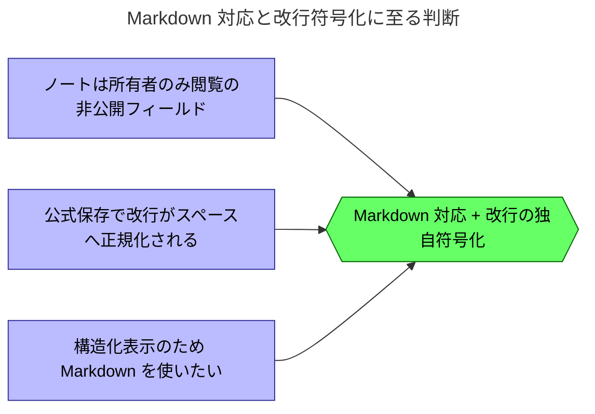

# ノートを Markdown 対応にし、改行を独自符号化で保持する

## 背景

VRChat のノートは1行入力を前提とし、`PUT /users/{id}` で保存すると本文中の改行がサーバー側でスペースへ正規化される。本プロジェクトは公式 UI への体験不満を出発点とする拡張であり、この制約に素直に従うと複数行ノートが潰れ、目的である体験向上に反する。ノートは所有者のみが閲覧できる非公開フィールドであり、加えて Markdown による構造化表示も求めたいため、公式仕様に乗るか改行保持と記法対応を敷く独自仕様に踏み込むかを検討した。

## 判断

ノートを Markdown 対応とし、保存時に改行をセンチネル文字 `↵`（U+21B5）へ符号化して読み込み時に復号する独自ノート仕様を採用する。対応記法は下表に限定し、表示は bio と共用する `renderMd` が担う。符号化・復号は `packages/core` の純粋関数へ閉じ、センチネルは単一定数として切り出す。

| 記法 | 対応 |
|---|---|
| 太字 `**`・斜体 `*`・インラインコード `` ` `` | ○ |
| 箇条書き（`-` と `1.`）・引用 `>` | ○ |
| リンク・見出し・表・画像・生 HTML | ×（対象外） |

### 影響

- 公式アプリで所有者自身が見返すと、改行位置に `↵` が表示される。他ユーザーには見えない。
- センチネルを含まない既存ノートは復号が no-op となり、後方互換を保つ。
- 符号化・復号の層と対応記法の境界が、以後のノート実装の基準になる。

### 未決事項

- ユーザーが本文へ `↵` を直接入力した場合のエスケープ規則。

## 根拠

### 理由

- ノートが非公開なため、符号化文字が第三者の目に触れず、副作用が所有者自身に限定される。
- 改行を実文字のまま残す API 手段がなく、符号化が改行を保持する唯一の選択肢となる。
- 記法を絞ったのは、リンクや表がアプリ内表示で崩れやすく、非公開メモでの使用頻度も低いため。
- `↵` は単一グラフェムで、全置換による符号化・復号が単純に閉じる。
